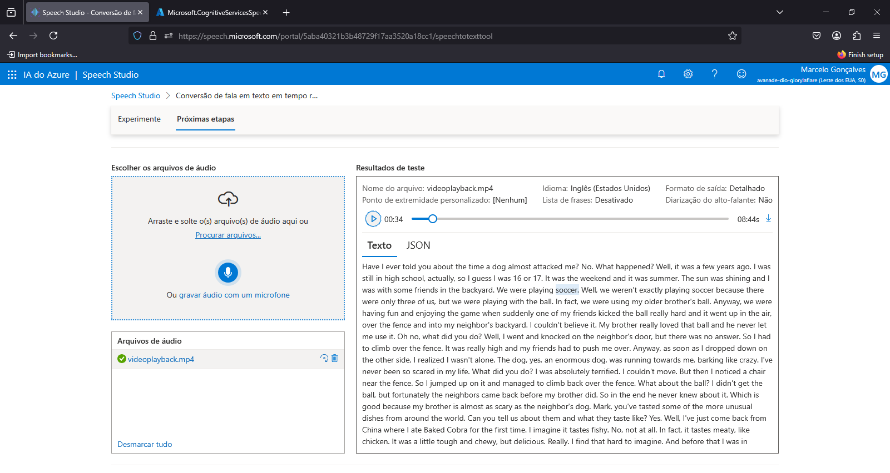
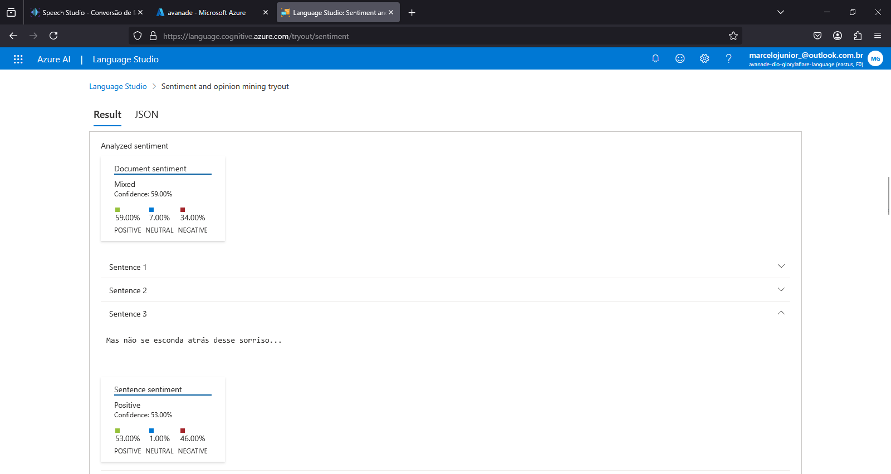
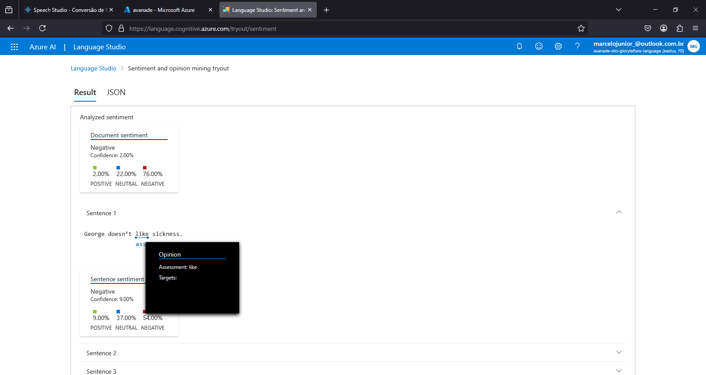

# 🔹 Projeto desenvolvido utilizando o Azure AI e o Copilot

Projeto desenvolvido para o bootcamp Decola Tech 2025 da Avanade com a Dio. A ideia desse projeto é explorar e entender mais sobre a plataforma da Microsoft Azure. 

# Speech Studio

No Speech Studio, o Azure AI fez a transcrição de um vídeo no formato MP4. A minha ideia, foi pegar um vídeo em inglês, cujo o tema é, auxiliar pessoas a praticar o "listening" em inglês. Vejo que a ferramenta é bastante útil para pessoas na qual tem certa dificuldade de ouvir e entender o que foi dito por outras pessoas de outros idiomas, com a ferramenta da IA é possível faciltiar esse processo, para pessoas que tem uma boa leitura e conseguem interpretar bem textos, mas tem dificuldades em ouvir uma língua em outro idioma. Vejo a ferramente como um auxílio rápido e prático para usuários que precisam transcrever áudios ou vídeos em tempo real.

# Language Studio

No Language Studio, o Azure AI faz uma análise de um texto observando seus sentimentos e opiniões inclusos nele. A ferramente é boa e facilita na análise, entendendo de uma perspectiva diferente, o que o autor queria transmitir com aquela mensagem. Através do JSON (link do JSON) é possível entender cada trecho do texto e quais sentimentos essas frases transmitem.

- [JSON com a resposta em Português](./inputs/language-studio/response_pt-br.json)

- [JSON com a resposta em Inglês](./inputs/language-studio/response_en.json)

#  Ai Serch

Foi útil para coletar informações de forma precisa, através de palavras chaves e afins. Sendo útil para coletar feedback e dados de maneira mais detalhada com uma análise inteligente e eficiente.

### search=*&$count=1
[Pesquisa usando o count](./inputs/ai-search/search_by_count[1].json)

### search=location:'Chicago'
[Pesquisa usando o location](./inputs/ai-search/search_by_location[chicago].json)