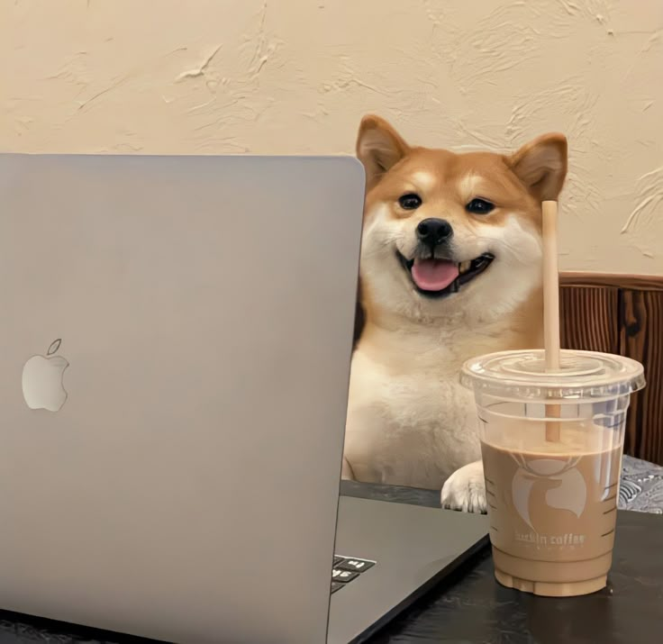
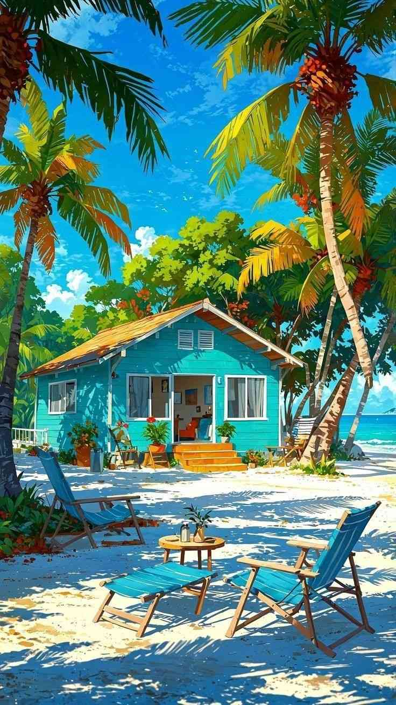
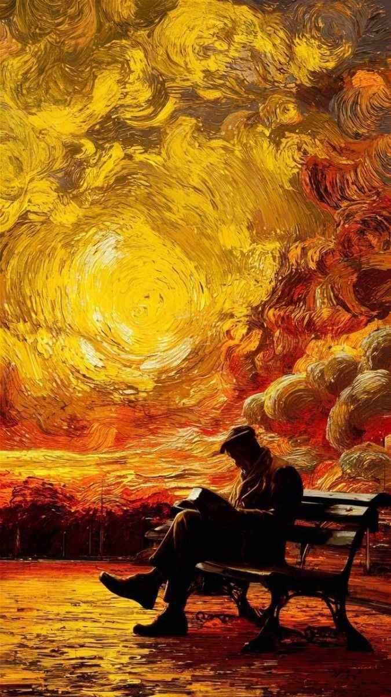
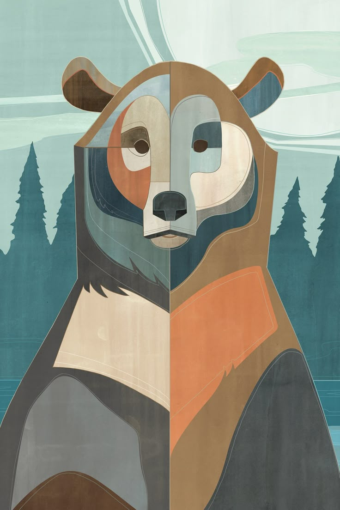
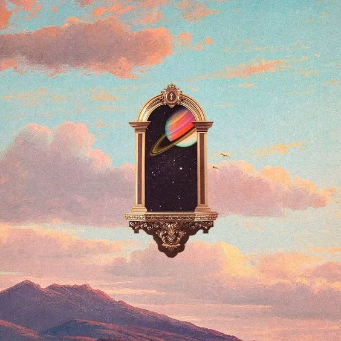

### 🖼️ imagem-1

Essa imagem é engraçada e cativante! Ela mostra um cachorro da raça Shiba Inu sentado atrás de um laptop com o logotipo da Apple. O Shiba Inu parece estar sorrindo, e há um copo de café gelado com um canudo na frente dele. O copo tem o logotipo e o texto "luckin coffee". O fundo é composto por uma parede texturizada e um painel de madeira.

Parece que o cachorrinho está "trabalhando" no laptop enquanto aproveita um café, criando uma cena divertida e humanizada. Se você estava procurando algo específico na imagem ou queria uma análise mais profunda, me avise! 😊

### 🖼️ imagem-2

A imagem transmite uma sensação de paz e relaxamento em um cenário paradisíaco. Ela retrata uma charmosa casa de praia pintada em azul-turquesa, cercada por um ambiente tropical exuberante com palmeiras e vegetação densa. A casa tem um telhado clássico de duas águas e uma varanda que convida ao descanso. Há cadeiras de praia dispostas na frente, sugerindo um espaço perfeito para aproveitar a vista e o clima.

O chão é coberto de areia branca, reforçando o clima descontraído típico de uma praia. No horizonte, vemos o mar azul contrastando com o céu limpo, pontuado por algumas nuvens. Parece ser o tipo de lugar ideal para desconectar-se do cotidiano e recarregar as energias.

Se você estava pensando em algo mais específico ao pedir a análise, me avise! 😊

### 🖼️ imagem-3

A imagem realmente possui características que lembram uma pintura, especialmente no estilo de Vincent van Gogh. Ela retrata uma figura sentada em um banco, aparentemente lendo um livro, e destaca-se como uma silhueta diante de um fundo vibrante. O fundo é extremamente expressivo, com pinceladas que misturam cores quentes e intensas, como amarelo, laranja e vermelho, criando uma sensação de movimento e energia. O céu tem espirais e nuvens turbulentas, que adicionam dinamismo à composição.

Parece capturar um momento de tranquilidade da figura em contraste com a intensidade do céu e do ambiente. É uma peça artística impactante, evocando sentimentos de introspecção e conexão com a natureza. Se você quiser explorar mais sobre o estilo ou a mensagem da obra, me avise! 😊

### 🖼️ imagem-4

A imagem apresenta uma ilustração artística de um urso retratado de maneira estilizada e geométrica. O rosto do urso é dividido em duas metades, cada uma com esquemas de cores e padrões distintos, criando um contraste visual interessante. No fundo, vemos uma floresta com árvores altas e um céu com formas abstratas, que podem representar nuvens.

A combinação de formas geométricas e a diversidade de cores dão um ar único e marcante à imagem, sugerindo um estilo criativo que mistura natureza e design moderno. Se quiser que eu aprofunde em algum detalhe específico ou interprete de outra forma, é só me avisar! 😊

### 🖼️ imagem-5

A imagem apresenta uma mistura fascinante de elementos surreais, naturais e cósmicos. Ela mostra uma moldura ornamentada, de estilo clássico e detalhado, flutuando no céu. O fundo é composto por nuvens e montanhas, evocando um cenário natural. Dentro da moldura, vemos uma representação do espaço, com um planeta semelhante a Saturno e anéis coloridos.

Essa composição cria um contraste intrigante entre a arte clássica da moldura e a imensidão do universo representado dentro dela, enquanto a paisagem ao redor adiciona uma base de realismo à cena. É uma peça que mistura fantasia, astronomia e surrealismo, transmitindo uma sensação de mistério e curiosidade.

Se você tiver algum ponto específico sobre o qual gostaria que eu focasse, é só me dizer! 😊